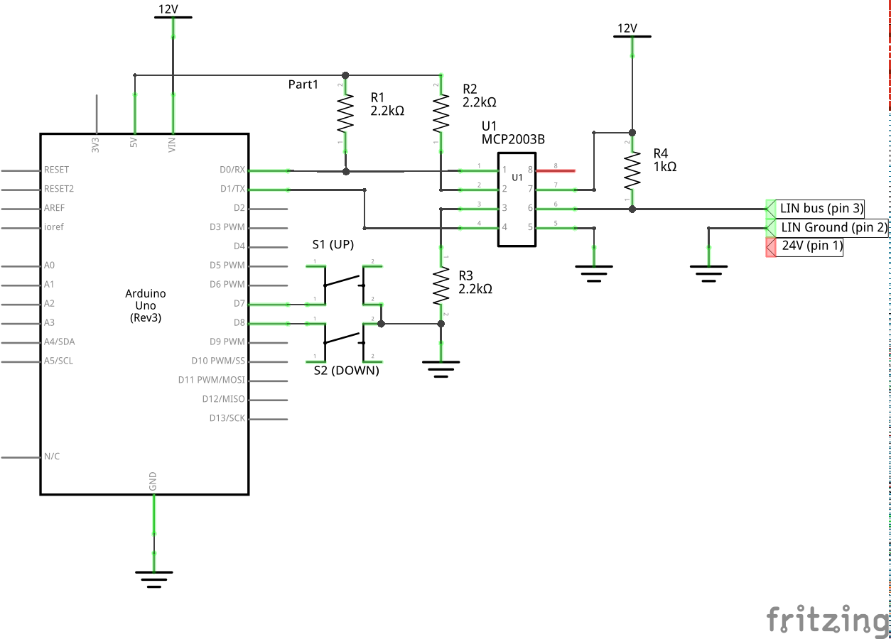
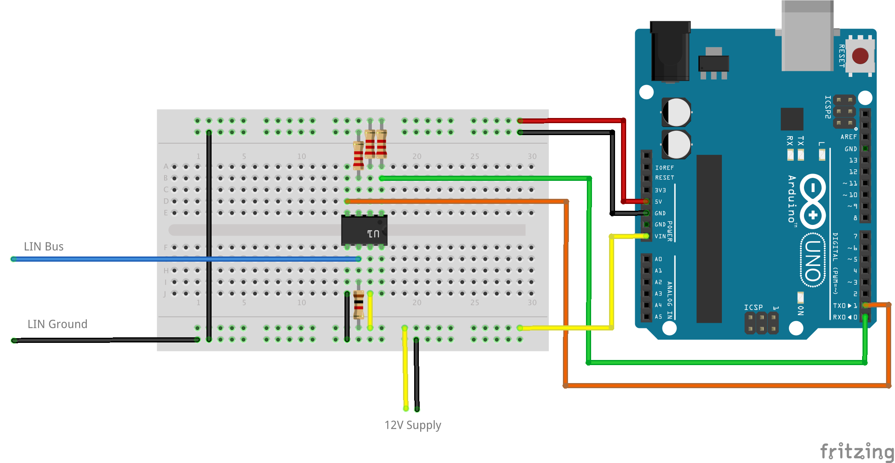

# IKEA Bekant Desk Controller

This is a simple Arduino firmware to control the IKEA Bekant motorized sit/stand desk.

## Circuit

The circuit for this sketch is based on an MCP2003B LIN transceiver.



And the accompanying schematic.



## Details of operation

Based on a blog post by Robert Nixdorf<sup>[1](#1)</sup>, it's quite clear that the desk is using the 1-wire LIN protocol<sup>[2](#2)</sup> to communicate between the controller and motors in both legs of the desk.

I've seen other posts from Gina Häußge<sup>[4](#4)</sup>, on the EEVblog forum <sup>[7](#7)</sup>, from Robin Reiter<sup>[6](#6)</sup>, and reposted on Hackaday<sup>[8](#8)</sup> and the AdaFruit Blog<sup>[9](#9)</sup>, but none of these have deciphered the LIN command protocol or completely replaced the existing controller. These hacks mostly focus reading the encoder value from LIN and sending button presses to the controller board, but modifications are a little messy, and I'd rather just plug into the bus and send commands directly.

LIN is a single-master bus, so in order to send commands we need to unplug the controller completely and replicate everything that it was doing in the replacement device. Luckily the protocol is simple, so this isn't too hard.

I am lucky enough to have access to an oscillocope that can do LIN decoding, so I used that extensively during my hacking and debugging.

The bus schedule was obvious by looking at the traffic. There is sequence of 10 messages, spaced 5 ms apart that repeat every 200ms. The ID sequence is 0x11, 0x08, 0x09, 0x10, 0x10, 0x10, 0x10, 0x10, 0x10, 0x01, 0x12.

I implemented a simple LIN master with an Arduino and a MCP2003B LIN transciever based on Andrew Stone's LIN library for arduino<sup>[5](#5)</sup> that can send these commands in the correct sequence, with the correct timing.

LIN is a single-wire shared bus, so it's impossible to tell which node is transmitting from a packet trace or oscilloscope readout. I know that the master must transmit the ID, so I set up my LIN master to transmit the IDs in sequence with no data. I saw that another device (presumably the motors) responded to IDs 0x08 and 0x09, so I know that the master should be reading from those IDs, and writing to the other IDs.

This means that the protocol is:

```
0x11: TX 0, 0, 0
0x08: RX 3 bytes
0x09: RX 3 bytes
0x10: TX 0 bytes; repeat 6 times
0x01: TX 0 bytes
0x12: TX 3 bytes
```

From my own decoding, and confirmed by the packet dumps in Robert Nixdorf's github repo<sup>[3](#3)</sup>, the pack format for 0x08, 0x09 and 0x12 seems to be a two-byte encoder value followed by a status or command byte. The first byte of the encoder value increments more quickly when the table is moving, so this is probably the LSB.

I've only seen three status codes on ID's 0x08 and 0x09:
```
0x60 desk not moving
0x02 starting to move
0x03 moving
```

I've seen more commands in the 0x12 message. These seem to be sent in a specific sequence:
```
0xFC not moving
0xC4 sent immediately before moving
0x86 up
0x85 down
0x87 1st command before stopping
0x84 2nd command before stopping
```

There are several other command codes in Robert Nixdorf's packet dumps that I haven't decoded yet. It looks like they are probably related to movement of the desk near the upper and lower limits.

I don't competely understand how the encoder values are used yet. Here are my observations so far:
 * The encoder values are clearly encoder values; they increment and the upper byte increments or decrements when the lower byte rolls over.
 * Higher values correspond to higher desk positions.
 * The encoder value in 0x08 always seems to be higher than 0x09. Unclear if this is by design or coincidence.
 * The encoder value in 0x12 seems to be a copy of the value in 0x08 or 0x09 most of the time, but I have occasionally seen other values.

I _think_ the encoder value is a target encoder value for one or both legs, and the command byte somehow releases a brake in each leg and commands it to move.

Sending 0x87 for a prolonged period of time causes the encoder values in 0x08 and 0x09 to reach the same values. Maybe this is an absolute positioning command?

Sending the wrong encoder values with the 0x85 (down?) command causes the motors to move unevenly and the desk to tilt. Sending 0x86 followed by 0x87 eventually corrects this.

# References
 1. <a name="1">http://blog.rnix.de/hacking-ikea-bekant/</a>
 2. <a name="2">https://en.wikipedia.org/wiki/Local_Interconnect_Network</a>
 3. <a name="3">https://github.com/diodenschein/TableMem</a>
 4. <a name="4">https://plus.google.com/u/1/+GinaH%C3%A4u%C3%9Fge/posts/3U5k1qKdLxH?pageId=none</a>
 5. <a name="5">https://github.com/gandrewstone/LIN</a>
 6. <a name="6">https://github.com/robin7331/IKEA-Hackant</a>
 7. <a name="7">https://www.eevblog.com/forum/beginners/ikea-bekant-desk-motorised-hack/</a>
 8. <a name="8">http://hackaday.com/2017/02/10/ikea-standing-desk-goes-dumb-to-smart-with-lin-bus/</a>
 9. <a name="9">https://blog.adafruit.com/2017/03/27/smarkant-ikea-bekant-adjustable-sitstand-table-controller-reverse-engineered-controlled-with-alexa/</a>
